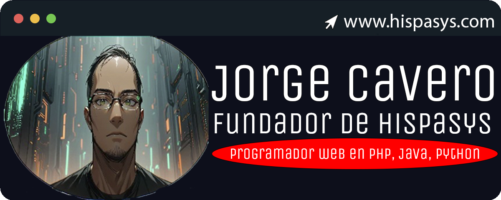

#  Hola, mi nombre es Jorge Cavero 👋
### Fundador de HispaSys y programador web en PHP, Java, Python y técnico especialista en ciberseguridad

Soy Jorge Cavero, un programador web con más de 10 años de experiencia en PHP, Java, y Python.

He trabajado en varios proyectos importantes, incluyendo [HispaSys](https://hispasys.com), [Seoactivo](https://seoactivo.com), [NavegaConVoz](https://navegaconvoz.com), y la web del [Mercat Central de Castellón](https://mercatcentralcastello.es). También soy técnico especialista en ciberseguridad, asegurando que los proyectos en los que trabajo sean tanto eficientes como seguros.

> ⭐️ ¡Explore mis proyectos en GitHub!

## Encuéntrame en:

# Únete a nuestra comunidad

Únete a nuestra comunidad en [HispaSys](https://hispasys.com) para aprender y desarrollar tus habilidades en programación y ciberseguridad.

> **Ofrecemos:** Cursos online, talleres, webinars, foros de discusión y mucho más. Únete hoy y empieza a crecer con nosotros.

# Algunos proyectos destacados

## Proyecto de Automatización en AWS

## Curso gratuito de Docker

## Gestión de Bases de Datos con SQL

## Videos educativos en YouTube:

<table style="width:100%">
<tr>
<td>

</td>
<td>

</td>
<td>

</td>
</tr>
</table>

## Contacto y apoyo:

[-D14836?style=for-the-badge&logo=gmail&logoColor=white&labelColor=101010)](mailto:contact@hispasys.com)

<!--
**coki89/coki89** is a ✨ _special_ ✨ repository because its `README.md` (this file) appears on your GitHub profile.

Here are some ideas to get you started:

- 🔭 I’m currently working on ...
- 🌱 I’m currently learning ...
- 👯 I’m looking to collaborate on ...
- 🤔 I’m looking for help with ...
- 💬 Ask me about ...
- 📫 How to reach me: ...
- 😄 Pronouns: ...
- ⚡ Fun fact: ...
-->