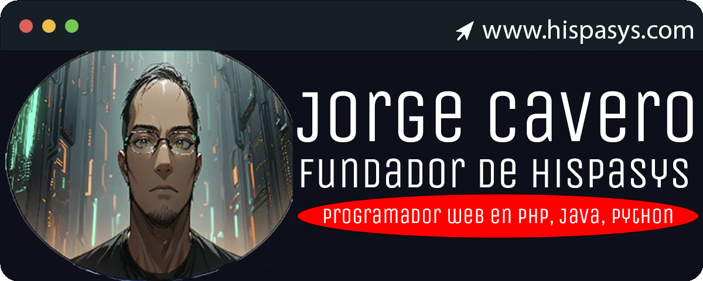

# 👋 ¡Hola, soy Jorge Cavero!

### 🚀 Fundador de HispaSys | Full Stack Developer | Ciberseguridad

---

## 👨‍💻 Sobre mí

Soy **Jorge Cavero**, desarrollador web con **más de 15 años de experiencia** creando soluciones digitales eficientes y seguras. Mi pasión es transformar ideas en productos funcionales que generen impacto real.

Actualmente lidero el desarrollo de proyectos clave:

| Proyecto | Estado | Descripción |
|----------|--------|-------------|
| 🏢 [**HispaSys**](https://hispasys.com) | ✅ Producción | Sistemas de gestión empresarial |
| 🎯 [**NavegaConVoz**](https://navegaconvoz.com) | ✅ Producción | Plataforma de marketing digital |
| 🏛️ [**Mercat Central de Castelló**](https://mercatcentralcastello.es) | ✅ Producción | Web institucional |

Además, soy **técnico especialista en ciberseguridad**, asegurando que cada proyecto cumpla con los más altos estándares de seguridad.

---

## 🛠️ Stack Tecnológico

| Categoría | Tecnologías |
|-----------|-------------|
| **Backend** |     |
| **Frontend** |      |
| **Bases de Datos** |    |
| **DevOps** |    |
| **Seguridad** | 🔐 OWASP Top 10 • Pentesting Web • Auditorías de Seguridad |

---

## 📊 GitHub Stats

---

## 🎯 Servicios Profesionales

| Servicio | Descripción |
|----------|-------------|
| 💼 **Desarrollo Web a Medida** | Sitios corporativos, e-commerce, aplicaciones web |
| 🏨 **Sistemas de Gestión** | Reservas, inventario, CRM, ERP, turismo |
| 🔒 **Auditorías de Seguridad** | Análisis de vulnerabilidades, pentesting web |
| ⚡ **Optimización y Migraciones** | Mejora de rendimiento, migración de legacy |

---

## 🔨 Proyectos en Desarrollo Activo

| Proyecto | Descripción | Tech Stack |
|----------|-------------|------------|
| [🧳 **Turistand**](https://github.com/coki89/turistand) | Plataforma de gestión turística con reservas y estadísticas | PHP, SQLite, Render |
| [🏨 **Hostal La Economía**](https://github.com/coki89/hostal-la-economia) | Sistema de reservas hoteleras con Stripe, 2FA y notificaciones push | PHP, SQLite, Render |
| [⏱️ **ControlHoras**](https://github.com/coki89/controlhoras) | Gestión de tiempos de trabajo con API REST y dashboard | Django, Python, SQLite |
| [🔐 **Nominacheck**](https://github.com/coki89/nominacheck) | Verificación de nóminas y seguros sociales | Node.js, PostgreSQL |
| [🇵🇾 **Paraguay Jeroki**](https://github.com/coki89/paraguay_jeroki) | Proyecto web institucional | HTML, CSS, JavaScript |

---

## 📫 Contacto

¿Tienes un proyecto en mente? ¡Hablemos!

| | |
|---|---|
| 🌐 **Web** |  |
| 💼 **LinkedIn** |  |
| 📧 **Email** |  |
| 🐙 **GitHub** |  |

---

  <em>⭐️ ¡Gracias por visitar mi perfil! No dudes en explorar mis proyectos y contactarme.</em>

